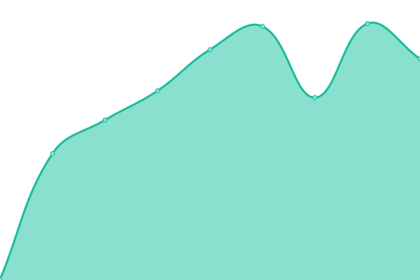

# [📈 Live Status](https://404incorporated.github.io/upptime): <!--live status--> **🟧 Partial outage**

This repository contains the open-source uptime monitor and status page for [404inc](https://404inc.org), powered by [Upptime](https://github.com/upptime/upptime).

With [Upptime](https://upptime.js.org), you can get your own unlimited and free uptime monitor and status page, powered entirely by a GitHub repository. We use [Issues](https://github.com/404incorporated/upptime/issues) as incident reports, [Actions](https://github.com/404incorporated/upptime/actions) as uptime monitors, and [Pages](https://404incorporated.github.io/upptime) for the status page.

<!--start: status pages-->
<!-- This summary is generated by Upptime (https://github.com/upptime/upptime) -->
<!-- Do not edit this manually, your changes will be overwritten -->
<!-- prettier-ignore -->
| URL | Status | History | Response Time | Uptime |
| --- | ------ | ------- | ------------- | ------ |
|  [404ing.org](https://404inc.org) | 🟩 Up | [404ing-org.yml](https://github.com/404incorporated/upptime/commits/HEAD/history/404ing-org.yml) | 

 422ms
     
 | 

<a href="https://status.404inc.org/history/404ing-org">100.00%</a>
    

|  [Panel](https://panel.404inc.org) | 🟩 Up | [panel.yml](https://github.com/404incorporated/upptime/commits/HEAD/history/panel.yml) | 

 657ms
     
 | 

<a href="https://status.404inc.org/history/panel">100.00%</a>
    

|  [Atlas-a1.boh](https://atlas-a1.boh.404inc.org) | 🟩 Up | [atlas-a1-boh.yml](https://github.com/404incorporated/upptime/commits/HEAD/history/atlas-a1-boh.yml) | 

 424ms
     
 | 

<a href="https://status.404inc.org/history/atlas-a1-boh">100.00%</a>
    

|  [Ganymede-a2.boh](https://ganymede-a2.boh.404inc.org) | 🟥 Down | [ganymede-a2-boh.yml](https://github.com/404incorporated/upptime/commits/HEAD/history/ganymede-a2-boh.yml) | 

 3491ms
     
 | 

<a href="https://status.404inc.org/history/ganymede-a2-boh">0.00%</a>
    

|  [Atlas-a1.ord](https://atlas-a1.ord.404inc.org:8080) | 🟩 Up | [atlas-a1-ord.yml](https://github.com/404incorporated/upptime/commits/HEAD/history/atlas-a1-ord.yml) | 

 188ms
     
 | 

<a href="https://status.404inc.org/history/atlas-a1-ord">100.00%</a>
    

|  [Ganymede-a2.ord](https://ganymede-a2.ord.404inc.org:8080) | 🟩 Up | [ganymede-a2-ord.yml](https://github.com/404incorporated/upptime/commits/HEAD/history/ganymede-a2-ord.yml) | 

 192ms
     
 | 

<a href="https://status.404inc.org/history/ganymede-a2-ord">100.00%</a>
    

|  [Ganymede-b2.ord](https://ganymede-b2.ord.404inc.org:8080) | 🟩 Up | [ganymede-b2-ord.yml](https://github.com/404incorporated/upptime/commits/HEAD/history/ganymede-b2-ord.yml) | 

 180ms
     
 | 

<a href="https://status.404inc.org/history/ganymede-b2-ord">100.00%</a>
    

<!--end: status pages-->

[**Visit our status website →**](https://404incorporated.github.io/upptime)

## 📄 License

- Powered by: [Upptime](https://github.com/upptime/upptime)
- Code: [MIT](./LICENSE) © [404inc](https://404inc.org)
- Data in the `./history` directory: [Open Database License](https://opendatacommons.org/licenses/odbl/1-0/)
